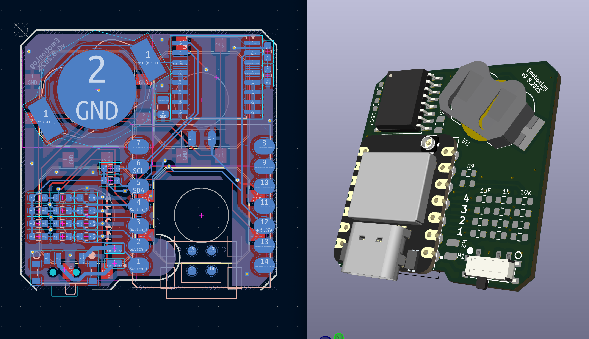
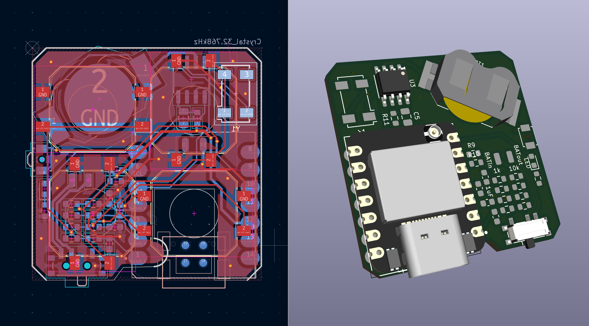
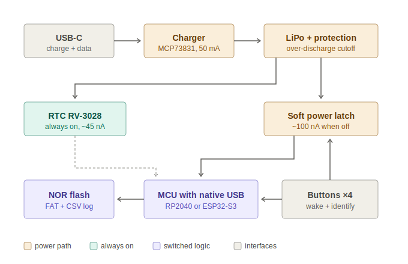

# MoodLogger

> **Attribution note:** This README (state documentation, roadmap) and the [Proposed v1 architecture](#proposed-v1-architecture-) section were drafted by **Claude (Fable 5)** on 2026-07-07, based on the KiCad files in this repo, the project motivation, and the Picoclick-C3 reference project. Sections contributed by Claude are marked with 🤖. Hardware design, prototypes, and project direction by Silvan Roth.

A tiny, battery-powered button logger. Press one of (at least) four buttons and the device wakes up, appends *which button was pressed at what time* to a CSV file, and goes back to sleep. To get the data, you plug the device into any USB host (cable or docking station) and it shows up as an ordinary USB flash drive — no companion app, no driver, no cloud. Grab the CSV, done.

## Design goals

- **≥ 4 buttons**, each press logged as `timestamp, button` to a CSV file
- **Wake on button press, sleep otherwise** — the device spends almost all of its life asleep
- **Battery life measured in months**: recharging should rarely, ideally almost never, be necessary
- **Host-agnostic data access**: the device enumerates as USB mass storage (a flash drive), so any OS can read the CSV without extra software
- **Accurate timestamps** from a dedicated RTC that keeps time even while the MCU sleeps

## Current state

Two prototype PCB revisions exist, both built around a **Seeed Studio XIAO ESP32-S3** module. They differ only in the RTC chip. Both are functional as prototypes but share one critical flaw (see [Known problems](#known-problems)).

### Common to both boards

- **MCU**: XIAO ESP32-S3 (U1) — provides USB-C, LiPo charging, and deep sleep
- **4 tactile buttons** (SW1–SW4, C&K PTS125) on XIAO pins D0–D3, each with a 10 k pull-up and 1 k series resistor, used as wake-up sources
- **I²C RTC** on D4/D5 (SDA/SCL)
- **CR1216 coin cell** (BT1) as RTC backup so time survives even when the main battery is empty
- **SPDT slide switch** (SW5) in the battery line as a hard power switch
- Main power from a LiPo cell on the XIAO's battery pads

### Version A — DS3231 (`EmotionTracker_DS32/`)

Board silkscreen: *EmotionLog v0 8.2025*

- **DS3231M** (U2, SOIC-16): temperature-compensated RTC with internal oscillator — very accurate, no external crystal needed, but comparatively power-hungry

### Version B — PCF8523 (`EmotionTracker_PCF8523/`)

- **PCF8523T** (U3, SOIC-8) with an external 32.768 kHz crystal (Y1) — much lower current draw than the DS3231, at the cost of needing the crystal and being less accurate over temperature
- Adds a status **LED** (D1), an extra small push button (SW6), and **BATin/BATout solder pads** in the battery path for measuring battery current / inserting protection circuitry
- `Dummy device/` contains a mechanical dummy PCB of the same outline for enclosure fitting

### Firmware (`Firmware/`)

Only a bring-up sketch exists so far: `Mood_track_v0/Mood_track_v0.ino` is a WS2812B/FastLED color-cycle test. The actual logging firmware (RTC, deep sleep, CSV writing, USB mass storage) has not been written yet.

## Known problems

**No battery over-discharge protection.** The XIAO ESP32-S3 has a charging circuit but no discharge cutoff, so when the device sits unused, the quiescent draw slowly pulls an unprotected LiPo below its safe minimum voltage and permanently damages it. This has already killed one battery. Nothing on either PCB revision protects against this.

**The XIAO is oversized for the job.** A full ESP32-S3 module with WiFi/BLE is overkill for "log a timestamp and sleep", and its deep-sleep and regulator overhead works against the battery-life goal.

## Roadmap

1. **Software safety first** (works on existing boards): monitor battery voltage from firmware and put the device into its lowest-power shutdown state below a cutoff threshold (with hysteresis so it doesn't oscillate near the limit). On the PCF8523 board the BATin/BATout pads can be used to hook up voltage sensing. This only *mitigates* the problem — even in deepest sleep the board still draws a few µA, so a fully drained device left on the shelf long enough can still damage the cell.
2. **Hardware protection**: add a proper battery protection IC (over-discharge cutoff) to the next board revision, or use protected cells in the meantime.
3. **Custom v1 design**: move away from the XIAO to a leaner MCU chosen for ultra-low power and native USB mass-storage support, designed from the start around the goals above — see [Proposed v1 architecture](#proposed-v1-architecture-) below.

## Proposed v1 architecture 🤖

*Section author: Claude (Fable 5), 2026-07-07. Based on the boards above and the [Picoclick-C3](https://github.com/makermoekoe/Picoclick-C3) reference project (fork in `Reference Projects/`). Not yet reviewed against a prototype — treat as a design proposal, not a verified design.*

### Core idea: soft power latch instead of deep sleep

The key technique to adopt from the Picoclick is its **soft-latching power circuit**: between presses the MCU is not asleep, it is completely unpowered. A button press physically connects the battery to the regulator; the firmware's first act is to hold that connection via a latch GPIO, it logs the event, then releases the latch and the device switches itself off. The Picoclick C3 reaches **< 200 nA idle** this way — roughly three orders of magnitude below the XIAO's deep sleep — and it doubles as the discharge-protection strategy: a device that draws almost nothing cannot slowly kill its LiPo. A protection IC remains as the hard backstop.

> ⚠️ **Do not copy the Picoclick's MCU.** The ESP32-C3's USB port is a fixed USB-Serial-JTAG peripheral and *cannot* enumerate as a mass-storage device, which kills the "shows up as a flash drive" requirement. An MCU with a real USB device controller is required (RP2040/RP2350, ESP32-S2/S3, …).

### Suggested parts

| Block | Suggestion | Why |
|---|---|---|
| MCU | **RP2040 / RP2350** | Native USB, mature TinyUSB mass-storage support (its bootloader is itself an MSC drive). Boots to user code in tens of ms — important, because with a latch the firmware must grab power before the button is released (the Picoclick needed ESP-IDF tuning to get from 300 ms to 68 ms; RP2040 gives this for free). No unused radio, ~$1. Alternative: bare ESP32-S3 keeps the current toolchain. |
| Data + program storage | 8–16 MB QSPI NOR flash | Required by the RP2040 anyway; holds firmware plus years of CSV in a FAT partition. |
| RTC | **RV-3028-C7** | ~45 nA (vs ~2 µA for the DS3231M — 10× the whole Picoclick standby budget on its own), ±1 ppm factory calibrated, no external crystal, automatic backup switchover. Can run straight from the main cell; the CR1216 becomes optional. The PCF8523 (~150–220 nA) is a workable second choice already proven on board B. |
| Charger | MCP73831-class, modest charge current | Matches small LiPo cells, same approach as Picoclick. |
| Battery protection | BQ297xx or DW01A + FETs (or a protected cell) | Hard backstop against over-discharge — the failure that killed the prototype battery. |
| Battery sense | Divider with high-side enable GPIO | An always-connected divider is the Picoclick C3T's *entire* 3 µA standby draw; switching it makes it free. |

### Buttons, wake, and logging flow

Each of the four buttons does double duty: all are diode-ORed (Schottky) into the latch enable, so any press powers the board, and each also drives its own sense GPIO with a small RC hold so firmware can still read *which* button fired after boot. USB VBUS feeds the same latch OR, so plugging into any host wakes the device.

- **Log event**: boot → grab latch → read RTC over I²C → append `timestamp,button` to CSV (FatFs on NOR flash) → release latch.
- **USB attached**: enumerate as USB MSC exposing the FAT volume; pause logging while mounted.
- **Setting the clock without an app**: the firmware reads the modification timestamp of a marker file (e.g. the user saves an empty `settime.txt` to the drive) — FAT directory entries carry the host's local time, so any OS can set the RTC just by writing a file. Set-on-flash as baseline.

### Power budget (estimate)

A log event costs roughly 1 µAh (~30 mA for ~100 ms); 20 presses/day is ~0.5 mAh/month. Standby is dominated by the protection IC's ~2–3 µA quiescent. Even a 100 mAh cell lasts multiple years and is realistically limited by self-discharge — with the protection IC cutting the cell off safely at the end instead of destroying it.

## Repository layout

| Path | Contents |
|---|---|
| `EmotionTracker_DS32/` | KiCad 8 project, DS3231 revision (`production/` has JLCPCB gerbers, BOM, placement files) |
| `EmotionTracker_PCF8523/` | KiCad 8 project, PCF8523 revision + mechanical dummy board (`production/` as above) |
| `Firmware/Mood_track_v0/` | Arduino bring-up sketch (LED test only, no logging yet) |
| `Reference Projects/` | Picoclick-C3-Logger (git submodule, fork of makermoekoe/Picoclick-C3) — reference for the latch circuit and battery protection |
| `docs/` | Architecture diagrams |

## History

The concept was first prototyped on a breadboard with a XIAO ESP32-S3 and a DS3231 RTC module. That prototype worked, but the lack of discharge protection destroyed the battery — which is what motivated the roadmap above.
